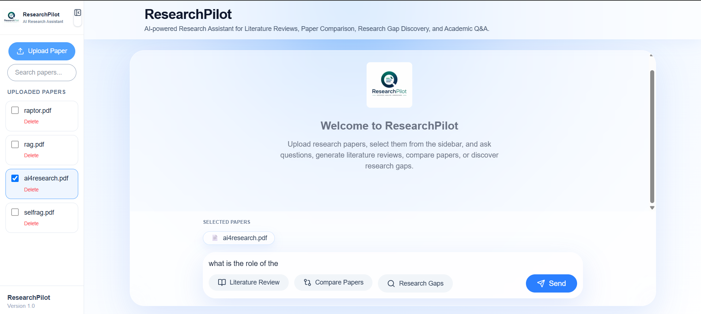
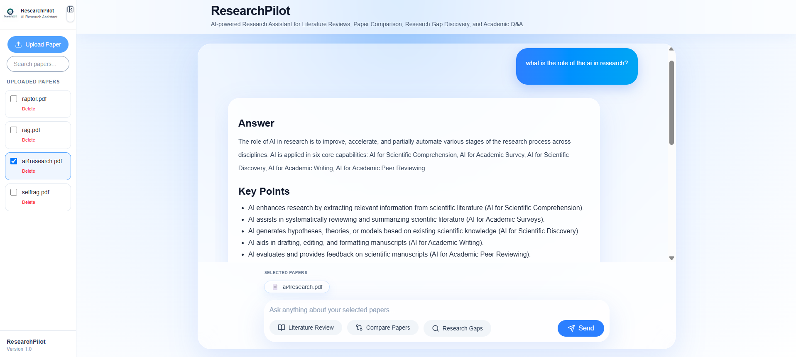
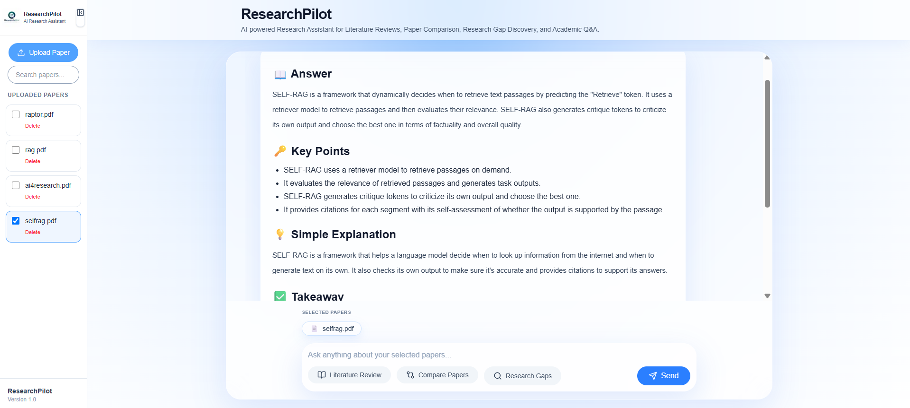
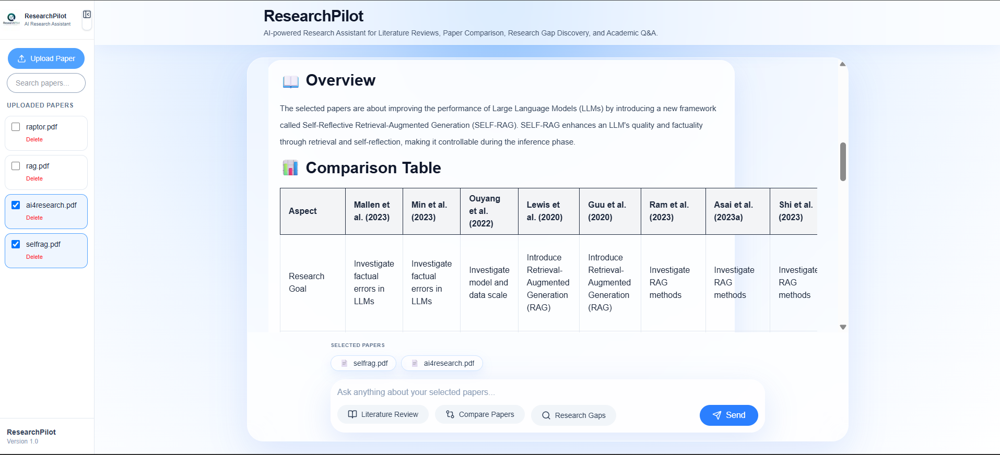
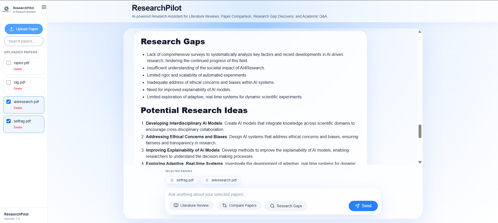

<div align="center">


# ResearchPilot

### AI-Powered Research Assistant for Literature Review, Paper Comparison, Research Gap Discovery, and Academic Question Answering


</div>

---

## Overview

ResearchPilot is a full-stack AI-powered research assistant designed to simplify academic literature analysis. The application enables researchers and students to upload research papers, interact with them using natural language, generate literature reviews, compare multiple papers, identify research gaps, and export AI-generated responses into Microsoft Word documents.

The system combines modern web technologies with AI-assisted document understanding to reduce the time required for reviewing academic literature while improving accessibility and productivity.

---

## Key Features

- 📄 Upload and manage research papers in PDF format
- 🤖 AI-powered academic question answering
- 📚 Automatic literature review generation
- ⚖️ Compare multiple research papers
- 🔍 Research gap identification
- 📌 Source attribution for every AI response
- 💡 Intelligent follow-up question suggestions
- 📥 Export AI responses to Microsoft Word (.docx)
- 🎨 Responsive modern user interface
- ⚡ FastAPI-powered backend APIs

---

## Screenshots

### Home Page



---

### AI Chat



---

### Literature Review



---

### Compare Papers



---

### Research Gap Detection




---

## Technology Stack

### Frontend

- Next.js
- React
- TypeScript
- Tailwind CSS
- Axios
- React Markdown

### Backend

- FastAPI
- Python
- Uvicorn

### AI & Document Processing

- Docling
- Markdown Processing
- Large Language Model Integration
- Prompt Engineering

### Development Tools

- Git
- GitHub
- Visual Studio Code

---

## Project Structure

```text
ResearchPilot
│
├── frontend
│   ├── app
│   ├── components
│   ├── services
│   ├── public
│   └── styles
│
├── backend
│   ├── app
│   │   ├── routers
│   │   ├── services
│   │   ├── parsers
│   │   ├── models
│   │   ├── export
│   │   └── storage
│   │
│   ├── requirements.txt
│   └── main.py
│
├── assets
│
└── README.md
```

---

## Core Modules

### Document Upload

Upload research papers in PDF format through an intuitive web interface.

---

### Document Parsing

Research papers are automatically parsed into structured markdown using Docling for downstream AI processing.

---

### AI Chat

Ask questions related to one or multiple uploaded papers and receive contextual AI-generated responses.

---

### Literature Review

Automatically generate concise literature reviews by synthesizing information from selected research papers.

---

### Paper Comparison

Compare multiple research papers based on objectives, methodology, strengths, limitations, datasets, and findings.

---

### Research Gap Discovery

Identify unexplored research opportunities and future work suggestions using AI.

---

### Source Attribution

Every generated response includes supporting document references to improve transparency.

---

### Export Module

Export AI-generated responses directly into Microsoft Word documents.

---

## Installation

### Clone Repository

```bash
git clone https://github.com/karmanyima08/ResearchPilot.git

cd ResearchPilot
```

---

### Backend Setup

```bash
cd backend

python -m venv .venv

# Windows

.venv\Scripts\activate

pip install -r requirements.txt

uvicorn app.main:app --reload
```

Backend runs at

```
http://127.0.0.1:8000
```

---

### Frontend Setup

```bash
cd frontend

npm install

npm run dev
```

Frontend runs at

```
http://localhost:3000
```

---

## Usage

1. Launch the backend server.
2. Launch the frontend application.
3. Upload one or more research papers.
4. Select papers from the sidebar.
5. Ask questions or use:

- Literature Review
- Compare Papers
- Research Gaps

6. Review contextual source references.
7. Export responses to Microsoft Word.

---

## Future Scope

- User authentication
- Cloud deployment
- Semantic vector search
- Citation generation
- Support for DOCX and TXT documents
- Collaborative research workspace
- Advanced retrieval optimization
- Research recommendation system

---

## Project Highlights

- Full-stack AI application
- Modular architecture
- RESTful API design
- Responsive modern UI
- Explainable AI through source attribution
- Professional document export
- Academic research workflow automation

---

## Author

**Karma Nyma Gyalsan**

B.Tech Computer Science Engineering

BML Munjal University

Frontend Development | Artificial Intelligence | Full Stack Development

---

## License

This project was developed as part of the **Practice School II (PS-II)** internship at **BML Munjal University** for academic purposes.

---

<div align="center">
ss
</div>